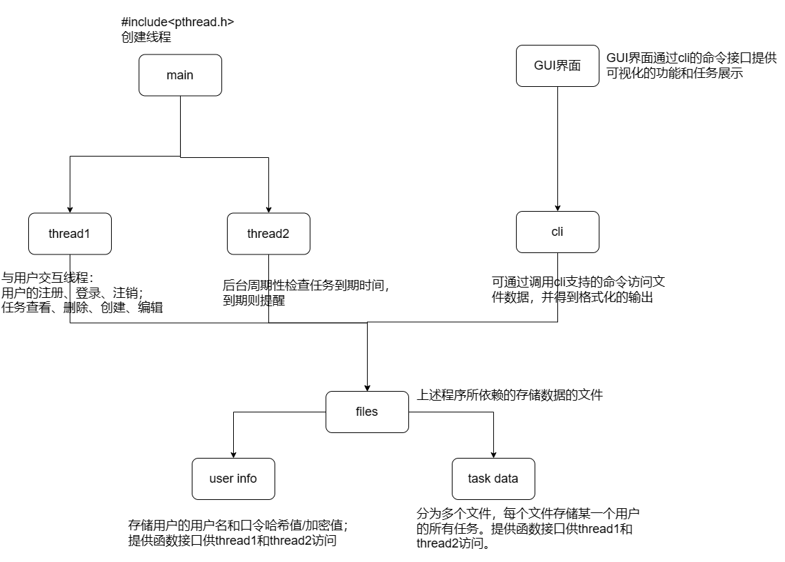
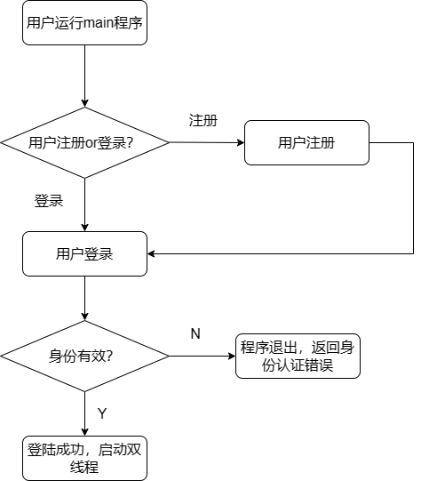
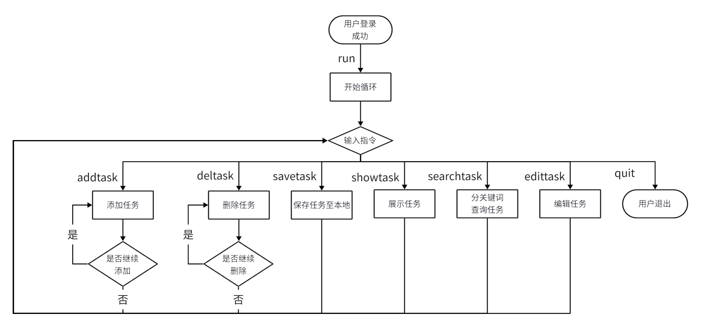
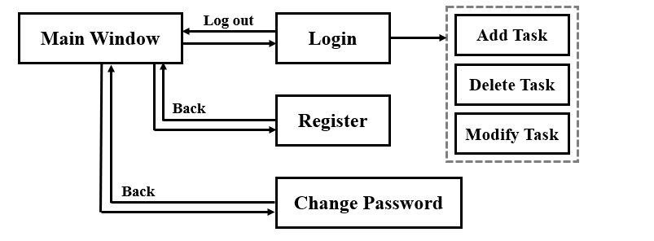
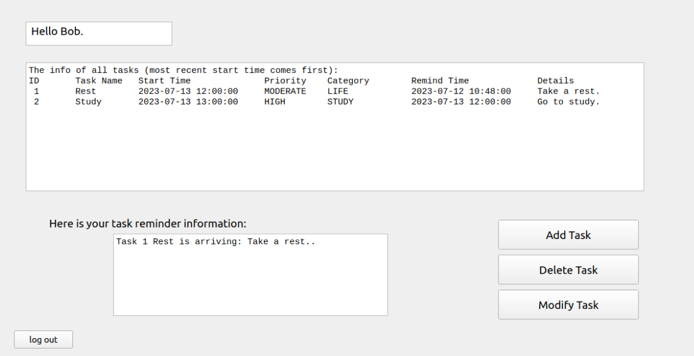

# NIS1336 日程管理软件设计文档

**项目成员**：陈嘉蔚，张玙璠，王翔之

## 项目总架构以及成员分工

### 项目架构

总体项目设计架构如下：



其中，与文件相关的函数提供对存储用户密码的文件、存储各个用户任务列表的文件的访问能力。用户交互程序上有两部分：第一部分以多线程的方式实现，其中一个线程以循环的方式从用户获取命令，另一个线程在后台周期性检查到期任务并打印提醒，两线程的互斥以互斥锁`pthread_mutex_t`实现。

第二部分中，程序cli支持了多种命令例如add、del、alt、check等来提供对任务进行访问。GUI界面通过调用这些命令来可视化日程管理的功能。此部分中互斥锁使用`fcntl`函数来保证进程间互斥。

### 成员分工

根据上述各部分的功能，成员分工如下：陈嘉蔚负责主函数(main)部分、周期性任务检查(thread2)部分和支持以命令方式访问文件数据(cli)部分；张玙璠负责文件数据访问接口(files)部分以及用户界面(GUI)部分；王翔之负责循环方式与用户交互(thread1)部分。

## 模块与类的设计

### 类（结构体）设计

程序中主要涉及的数据类型`Task`结构体位于`/src/types.h`文件中，提供对存储用户账户信息的文件的读写能力的类位于`src/Account.h`中。

首先，针对于任务类型和任务优先级，以枚举类型定义如下：

```cpp
enum Priority{
    HIGH, MODERATE, LOW
};

enum Category{
    STUDY, LIFE, ENTERTAINMENT
};
```

对于任务信息，任务结构体设计如下：

```cpp
typedef struct
{
    int id; 
    char name[32];
    time_t s_time;  //任务启动时间
    Priority prio;  //任务优先级
    Category cat;   //类别
    time_t rem; //reminder, 提醒时间
    char detail[256];   //任务详细信息
}Task;
```

其中，`time_t`为`time.h`中的类型。

对于用户信息，用户结构体设计如下：

```cpp
typedef struct{
    int id; // user_id
    char username[32];
    char password[128]; // hash
}User;
```

对于提供对用户账户信息的访问，设计的类`Account`如下：

```cpp
class Account
{
public:
    Account(const string& filename);
    ~Account();

    bool registerUser(const char* username, const char* password);
    User login(const char* username, const char* password);
    bool changePassword(const char* username, const char* password, const char* newpassword);

private:
    string filename;

};
```

其中，`filename`指定访问的存储用户信息的文件，`registerUser`可用于在该文件中创建一个新用户；`login`用户验证用户账号密码是否正确，返回值为用户详细信息`User`类；`changePassword`用于提供用户修改密码。

### 模块设计

#### 文件访问接口模块

文件访问接口模块提供2个功能：1.用户账户管理 2.任务列表存取

##### 1.用户账户管理

用户账户管理板块主要是对存储用户信息的文件进行修改和存取操作。具体的功能已经在`Account`类的介绍中详细说明。


##### 2.任务列表存取

该模块是对用户的任务列表文件的读取和存储操作，该模块的实现在`bin/Tasks.h`中，具体功能如下：
```cpp
void showTask(const vector<Task>& tasks);
void loadTask(vector<Task>& tasks, const User* user);
void saveTask(const vector<Task>& tasks, const User* user);
```
其中，`showTask`打印指定用户的任务列表，`loadTask`加载指定用户任务列表文件中的任务信息，`saveTask`保存任务信息到指定用户的任务列表文件中。


#### 命令行交互部分

程序大致逻辑如下：



命令行交互程序位于`bin/`下的`main`程序。该程序首先询问用户注册或登录，进行用户身份验证。若身份验证失败，则程序返回错误信息，并且退出。

若用户身份验证成功，则由该程序启动两个线程，其中一个线程以循环的方式与用户进行交互，另一个线程在后台周期性检查任务列表，对到达提醒时间的任务进行提醒。


#### 用户交互部分

用户交互逻辑大致如下：


用户交互线程程序实现位于`/src` 下的`thread1.h` `thread1.cpp` 文件中。

在登录成功后，用户通过输入`run` 使程序开始循环接受指令。主要有7种指令：

`addtask` , `deltask` , `savetask` , `showtask` , `serachtask` , `quit`

其中，`addtask` , `deltask` 可循环进行多次重复操作，实现批量增加、删除任务。

`searchtask`支持5中不同查找方式，包括

- 查找相同优先级
- 查找相同类别 
- 查找相同开始时间（同日 / 同月 / 同年）

用户输入`quit` 指令后，循环结束，用户交互线程结束。同时更新`thread_arg` ， 保证另一线程可同步结束，最后完成程序执行。


#### 图形界面部分

图形界面部分调用`bin/`目录下的`cli`可执行文件，通过提供命令行参数返回数据，而后以可视化的方式展示给用户。`cli`程序支持的命令如下：

```bash
./cli show	# 展示登录用户的任务列表
./cli add	# 向用户任务列表中添加任务
./cli del	# 删除用户任务列表中的某一个任务
./cli alt	# 修改用户任务列表中某一任务的详细信息
./cli login	# 验证用户输入的账号密码是否合法
./cli reg	# 提供用户注册
./cli passwd	# 用户修改其账户的密码
./cli check	# 检查一次用户当前任务列表是否有已到达提醒时间的任务
./cli help	# 打印帮助信息
```

图形界面的执行流程如下：



在命令行输入以下命令打开图形界面：
```cpp
cd bin
./Schedule
```

图形界面的主界面如图，用户在这个页面可以进行登录、注册和修改密码的操作：


用户登录后，可以看到自己的任务列表和任务提醒信息。任务提醒信息在到达用户设置的提醒时间`Remind Time`时开始提醒，提醒信息每3秒钟更新一次。



用户通过`Add Task`、`Delete Task`、`Modify Task`按钮可以添加、删除或修改任务，通过`QT`的信号与槽机制`connect()`函数实现自动更新任务列表的功能。例如：新任务添加成功后发出`taskAdded`信号，自动调用原用户界面的`Refresh`函数更新列表：
```cpp
connect(addtask, &Addtask::taskAdded, this, &User::Refresh);
connect(deletetask, &Deletetask::taskDeleted, this, &User::Refresh);
connect(modifytask, &Modifytask::modifytask, this, &User::Refresh);
```

自动更新的效果如下：


## 项目关键技术说明

### 进程间读写文件互斥和线程间读写文件互斥

考虑到检查到期任务时从文件中读取任务信息可能会与用户增加、删除任务的操作重合，导致同时访问文件造成文件数据混乱，程序中使用互斥锁来解决这种读写的不同步。

#### 线程中的访问互斥

在命令行交互部分，由于用户交互界面和周期性检查属于同一个进程的不同线程，因此在主程序中定义了互斥锁`mutex`：

```cpp
pthread_mutex_t mutex = PTHREAD_MUTEX_INITIALIZER;
```

并且将该锁的指针通过传参的方式传递给两个线程：

```cpp
thread_arg.mutex = &mutex;
ret = pthread_create(&(tids[0]), NULL, thread1, &thread_arg);
ret = pthread_create(&(tids[1]), NULL, thread2, &thread_arg);
```

在两个线程中，如果需要访问储存用户任务列表的文件，则对`mutex`上锁；读取结束后，对其解锁：

```cpp
pthread_mutex_lock(mutex);
loadTask(tasklist, user);
pthread_mutex_unlock(mutex);
```

从而保证线程间的访问互斥。

#### 进程间的访问互斥

在图形化界面中，若图形界面程序发出了信号调用`./cli check`的同时，用户试图发出命令增加任务，此时也会造成文件混乱。该问题采取进程间互斥锁`fcntl`实现，其位于与文件读写有关的函数中，例如`loadTask()`、`saveTask()`。此处以`loadTask()`中的代码为例。

```cpp
//begin lock
int fd = open((USER_DIR + user_name).c_str(), O_RDWR);
if(fd == -1){
	FILE* fp = fopen((USER_DIR + user_name).c_str(), "w");
	fclose(fp);
	fd = open((USER_DIR + user_name).c_str(), O_RDWR);
}
    
struct flock fl;
fl.l_type = F_WRLCK;
fl.l_whence = SEEK_SET;
fl.l_start = 0;
fl.l_len = 0;
fl.l_pid = getpid();

fcntl(fd, F_SETLKW, &fl);
//end lock

[snip]

//release lock
fl.l_type = F_UNLCK;
fcntl(fd, F_SETLKW, &fl);
close(fd);
```

上述过程中，首先获得用户任务数据文件的文件描述符fd，若无则创建该文件并再次试图获取。而后，定义一个flock的实例，其为对文件的锁的描述。其中，`l_type`描述锁的类型，此处为独占锁，即当该进程占有了文件锁，则其他进程无法再获取该文件的锁；`l_whence`、`l_start`、`l_len`描述加锁范围，此处为文件的所有内容；`l_pid`描述该锁被哪个进程占有，此处以`getpid()`函数获取当前进程进程号。

随后调用`fcntl`对文件上锁，`F_SETLKW`表示获取锁失败时，在此处阻塞而非退出。如果获取锁失败，则该进程被阻塞，等待文件锁被释放，该进程继续运行。

当该函数对文件读写操作结束后，`l_type`设为`F_UNLCK`，再次调用`fcntl`函数释放文件锁。此时，若有其它进程被阻塞，则可以试图获取该锁并且继续进行访问。


## 课程感受

本次课程基于linux平台开发一款日程管理软件，不仅增加了我对于linux平台编程的知识和了解，也锻炼了我的编程能力。在这次项目中，我对命令行处理、图形界面设计、文件读写、多线程编程以及合作开发软件的流程有了一定的掌握并且进行了练习，使我们受益匪浅。

在这门课程中，我通过亲自动手实践学习了如何进行程序开发，和队友合作完成大作业的过程中提高了合作交流能力。建议往后的编程课最好在插座比较多的教室进行，由于教室里大部分插座没电，上课上到一半经常需要到教室外去找插座，影响上课效率。

课程中，深化了 C++编程语言的学习，掌了握Linux Bash基本命令，深入了解了编译、链接以及调试等关键概念和工具的使用。通过课上的项目，得到了宝贵的编程实践经验。课程中GNUMake、CMake和Git等工具也让我更好地理解了代码组织、版本控制和团队协作的重要性。建议可以加强对代码规范和最佳实践的讲解，培养学生良好的编程习惯和工程素养。

